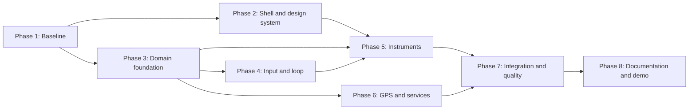

# Interactive Automotive Dashboard - Implementation Plan

**Status:** Ready for implementation  
**Version:** 1.0  
**Methodology stage:** PLAN  
**Inputs:** [Functional specification](./functional-specification.md), [Technical specification](./technical-specification.md)  
**Task details:** [Technical backlog](./backlog.md)

## 1. Delivery Strategy

Build one vertical path early: local page -> input -> vehicle state -> event -> speed display. Add battery and warnings on the same state flow, then add GPS as a progressively enhanced component. Keep each ticket independently reviewable and run the narrowest related tests after every change.

Priority rules:

- **P1:** Required for a complete, demonstrable, accessible MVP.
- **P2:** Important hardening or enhanced GPS behavior; implement after the offline-safe core.
- **P3:** Optional polish that must not delay acceptance of P1 work.

## 2. Dependency Flow

## 3. Phase 1 - Baseline And Guardrails

### Goal

Establish the local runtime, validation commands, directory boundaries, and project-wide development rules before feature code begins.

### Inputs

- Approved functional and technical specifications.
- HTML/CSS/JavaScript and no-backend constraints.
- Target browser and viewport matrix.

### Outputs

- Minimal package scripts and documented prerequisites.
- Agreed project structure.
- Copilot instructions, agents, and skills available to contributors.
- A test command that succeeds with an initial smoke test.

### Dependencies

None. This phase gates all implementation work.

### Plan Items

- **P1.1:** Establish project scripts and the recommended directory structure (`T001`).
- **P1.2:** Activate repository-wide Copilot contribution rules and scoped workflows (delivered in `.github/`).

### Validation Criteria

- `npm test` exits successfully.
- `npm start` serves the project over local HTTP.
- No backend, framework, bundler, or secret is required.
- All SPEC and PLAN artifacts are linked and internally consistent.

## 4. Phase 2 - Semantic Shell And Design System

### Goal

Create an accessible, responsive cockpit skeleton with stable visual tokens before connecting behavior.

### Inputs

- User experience, display, accessibility, and responsive requirements.
- Folder and CSS ownership decisions.

### Outputs

- Semantic dashboard markup and static fallback content.
- Shared design tokens, reset, typography, and responsive layout.
- Stable regions for speed, battery, energy, alerts, GPS, and controls.

### Dependencies

Phase 1.

### Plan Items

- **P2.1:** Create semantic application landmarks and instrument roots (`T002`).
- **P2.2:** Implement design tokens, typography, reset, and theme-safe states (`T003`).
- **P2.3:** Implement the desktop, tablet, and mobile cockpit layout (`T004`).

### Validation Criteria

- Markup is valid and usable before JavaScript initialization.
- No overlap or horizontal page scrolling occurs at `360x800`, `768x1024`, or `1440x900`.
- Keyboard focus is visible and core regions have programmatic names.
- Dynamic value placeholders have stable dimensions.

## 5. Phase 3 - Domain Foundation

### Goal

Implement the deterministic, DOM-independent state and event core that owns all vehicle rules.

### Inputs

- Application state table, invariants, thresholds, and timing assumptions.
- State and event contracts from the technical specification.

### Outputs

- Frozen configuration catalogs.
- Tested event bus.
- Vehicle model with guarded transitions, time-based physics, battery rules, and alerts.
- Immutable snapshots suitable for independent renderers.

### Dependencies

Phase 1. It can proceed in parallel with Phase 2 after baseline approval.

### Plan Items

- **P3.1:** Implement central constants and warning catalog (`T006`).
- **P3.2:** Implement the synchronous event bus and unsubscribe contract (`T005`).
- **P3.3:** Implement initial vehicle state, public commands, and invariants (`T007`).
- **P3.4:** Implement time-based motion and navigation calculations (`T008`).
- **P3.5:** Implement battery drain, range, charge, and depletion (`T009`).
- **P3.6:** Derive warning lifecycle and deterministic priority (`T010`).

### Validation Criteria

- Unit tests cover accepted and rejected state transitions.
- Known elapsed times produce deterministic speed, distance, and charge changes.
- Published snapshots are frozen copies and cannot mutate the model.
- Boundary values never exceed configured speed, battery, angle, or coordinate ranges.
- Warning raised/cleared events occur exactly once per threshold transition.

## 6. Phase 4 - Input And Simulation Loop

### Goal

Translate keyboard and on-screen actions into reliable driving intent and advance the model at animation cadence.

### Inputs

- Command matrix and keyboard shortcuts.
- Vehicle model API and event contracts.
- Semantic control roots from Phase 2.

### Outputs

- Central command/key binding catalog.
- Keyboard and pointer handling with hold/press semantics.
- Time-bounded simulation loop.
- Generated visible controls and command legend.

### Dependencies

Phases 2 and 3.

### Plan Items

- **P4.1:** Define action and key binding metadata (`T012`).
- **P4.2:** Implement keyboard lifecycle and stuck-input cleanup (`T013`).
- **P4.3:** Generate and bind equivalent on-screen controls (`T014`).
- **P4.4:** Implement the bounded `requestAnimationFrame` loop (`T011`).

### Validation Criteria

- Arrow and `WASD` alternatives produce equivalent intent.
- Press commands ignore native key repeat.
- Hold commands clear on release, blur, and visibility change.
- Pointer cancellation cannot leave a command active.
- The loop clamps large elapsed intervals and supports start/stop without duplication.

## 7. Phase 5 - Core Instruments And Alerts

### Goal

Render the required dashboard instruments from one immutable snapshot with accessible, stable display behavior.

### Inputs

- Dashboard shell and design tokens.
- Vehicle snapshot and warning catalog.
- State-change event.

### Outputs

- Functional speedometer.
- Battery gauge and secondary energy metrics.
- Prioritized warning panel and live announcements.
- Initial end-to-end path composed in `main.js`.

### Dependencies

Phases 2, 3, and 4.

### Plan Items

- **P5.1:** Render speed and visual scale (`T015`).
- **P5.2:** Render battery, range, consumption, and odometer (`T016`).
- **P5.3:** Render prioritized warnings and accessible lifecycle changes (`T017`).
- **P5.4:** Compose state, input, loop, and instrument subscriptions (`T022`).

### Validation Criteria

- Every accepted command updates the affected instrument on the next frame.
- Display values are finite, clamped, formatted, and dimensionally stable.
- Alert order is `critical > warning > info` and no meaning relies only on color.
- Unsubscribing or destroying a component stops its updates.
- The complete speed/battery/warning flow works with the network disabled.

## 8. Phase 6 - GPS And Progressive Services

### Goal

Deliver a useful offline GPS indicator first, then add permission-based location, maps, and routing without weakening core reliability.

### Inputs

- Position and heading snapshot fields.
- Error/degradation behavior and privacy requirements.
- Approved external dependency list.

### Outputs

- Coordinate, heading, and movement display with no network dependency.
- Explicit geolocation request flow.
- Optional Leaflet map and route integration.
- Offline, denied, timeout, invalid-response, and stale-request states.

### Dependencies

Phase 3 for state; Phase 2 for layout. Enhanced map tasks follow the offline indicator.

### Plan Items

- **P6.1:** Implement the offline-safe GPS indicator (`T018`).
- **P6.2:** Implement validated, opt-in browser geolocation (`T019`).
- **P6.3:** Add Leaflet and tile integration as a progressive enhancement (`T020`).
- **P6.4:** Add abortable routing and destination interaction (`T021`).

### Validation Criteria

- Coordinates and heading update while driving with network disabled.
- No permission prompt appears before the user requests location.
- Denial, timeout, unavailable APIs, and malformed data produce normalized non-blocking states.
- Failed map or route resources do not throw uncaught errors or stop simulation.
- A superseded route response cannot overwrite the current destination.

## 9. Phase 7 - Integration, Accessibility, And Hardening

### Goal

Prove the complete experience against acceptance criteria, target browsers, viewports, failure modes, performance budgets, and state invariants.

### Inputs

- All P1 runtime components.
- Acceptance scenarios `AC-001` through `AC-014`.
- Browser, viewport, privacy, and performance requirements.

### Outputs

- Complete unit/integration suite.
- Browser acceptance evidence and captured failure-mode results.
- Responsive and accessibility corrections.
- Performance and compatibility report.
- Optional theme/view polish only after P1 passes.

### Dependencies

Phases 5 and 6. Offline GPS is P1; enhanced map tasks may complete during this phase if needed.

### Plan Items

- **P7.1:** Complete deterministic unit and integration coverage (`T024`).
- **P7.2:** Validate browser acceptance and service degradation (`T025`).
- **P7.3:** Correct responsive and accessibility defects (`T023`).
- **P7.4:** Measure frame pacing, startup, and browser compatibility (`T026`).
- **P7.5:** Add non-blocking theme and cockpit-view polish if time remains (`T027`).

### Validation Criteria

- `npm test` passes from a clean checkout.
- All P1 acceptance scenarios pass with no uncaught console errors.
- Core workflow is keyboard-complete and has no critical automated accessibility findings.
- Screenshots at all target viewports show no overlap, clipping, or horizontal scrolling.
- Input feedback, frame pacing, and startup meet REQ-026, REQ-027, and REQ-035.

## 10. Phase 8 - Documentation And Demo Readiness

### Goal

Make the application reproducible, explainable, and ready for a reliable two-minute hackathon demonstration.

### Inputs

- Validated behavior, dependencies, fallbacks, controls, and test evidence.
- Final architecture and any approved deviations.

### Outputs

- Current README and consolidated project setup document.
- Traceable ticket and requirement status.
- Demo script covering normal and offline behavior.
- Final known-risk and deferred-scope list.

### Dependencies

Phase 7.

### Plan Items

- **P8.1:** Reconcile operator and architecture documentation with verified behavior (`T028`).
- **P8.2:** Run final clean-start, test, offline, and presentation checks (`T029`).

### Validation Criteria

- A new contributor can start and test the app from documentation alone.
- Every requirement links to planned implementation and validation evidence.
- The demo can be completed in under two minutes and includes a prepared offline fallback.
- No documentation claims an unimplemented or unverified capability.

## 11. Milestones

| Milestone | Exit condition | Included phases |
| --- | --- | --- |
| M1 - Architecture Ready | Specs, project rules, and baseline commands approved | Phase 1 |
| M2 - Vertical Slice | Ignition and acceleration update a visible speedometer | Phases 2-5 subset |
| M3 - Offline MVP | Speed, battery, warnings, controls, and coordinate GPS pass P1 checks offline | Phases 2-6 |
| M4 - Enhanced Demo | Permission-based map and route flow degrade safely | Phase 6 P2 tasks |
| M5 - Hackathon Ready | Acceptance, accessibility, responsive, performance, docs, and demo gates pass | Phases 7-8 |

## 12. Validation Matrix

| Gate | Command or method | Frequency | Blocking condition |
| --- | --- | --- | --- |
| Syntax/import | Targeted module import or `node --check` | Each JavaScript ticket | New syntax or import error |
| Unit/integration | `npm test` or targeted `node --test test/<file>` | Each behavior ticket | Related test failure |
| HTML | Standards validator or browser diagnostics | Shell changes | Invalid semantics affecting use |
| Accessibility | Automated scan plus keyboard/manual review | Each UI milestone | Critical core-flow finding |
| Responsive | Browser screenshots at three target sizes | Each layout milestone | Overlap, clipping, or horizontal scroll |
| Degradation | Offline mode and controlled service failures | GPS milestone and release | Core simulation stops or uncaught error |
| Performance | Browser performance trace and input timing | Integration milestone | Sustained under `30 fps`, over `100 ms` feedback, or over `2 s` local startup |
| Traceability | Requirement/ticket coverage script or review | End of each phase | Any requirement has no implementation or test evidence |

## 13. Requirement Mapping

| Requirement | Plan items | Primary tickets | Planned evidence |
| --- | --- | --- | --- |
| REQ-001 | P2.1, P5.4 | T002, T022 | Semantic shell and initial snapshot render |
| REQ-002 | P2.1, P5.1 | T002, T015 | Speedometer markup, renderer, and component tests |
| REQ-003 | P3.3, P4.1-P4.3 | T007, T012-T014 | Engine transition and control tests |
| REQ-004 | P3.4, P4.2 | T008, T013 | Controlled-time acceleration tests |
| REQ-005 | P3.4, P4.2 | T008, T013 | Controlled-time braking tests |
| REQ-006 | P3.4 | T008 | Drag behavior tests |
| REQ-007 | P3.4, P6.1 | T008, T018 | Heading and movement tests |
| REQ-008 | P4.1-P4.2 | T012, T013 | Binding consistency tests |
| REQ-009 | P4.2 | T013 | Release, blur, and visibility tests |
| REQ-010 | P4.3 | T014 | Pointer/touch parity acceptance |
| REQ-011 | P3.5, P5.2 | T009, T016 | Battery/range model and renderer tests |
| REQ-012 | P3.5 | T009 | Controlled-time drain tests |
| REQ-013 | P3.3, P3.5 | T007, T009 | Charging guard tests |
| REQ-014 | P3.3, P3.5 | T007, T009 | Charge boundary and depletion tests |
| REQ-015 | P3.6, P5.3 | T010, T017 | Alert lifecycle and priority tests |
| REQ-016 | P2.2, P5.3, P7.3 | T003, T017, T023 | Non-color cue and contrast evidence |
| REQ-017 | P3.1, P3.6 | T006, T010 | Parameterized warning threshold tests |
| REQ-018 | P6.1 | T018 | Offline coordinate/heading browser test |
| REQ-019 | P3.4, P6.1 | T008, T018 | Geographic calculation and UI tests |
| REQ-020 | P6.2 | T019 | Explicit permission-flow test |
| REQ-021 | P6.1-P6.4 | T018-T021 | Offline and failure-injection evidence |
| REQ-022 | P3.3, P7.1 | T007, T024 | State invariant suite |
| REQ-023 | P3.2-P3.3 | T005, T007 | Snapshot immutability and event tests |
| REQ-024 | P3.2, P5.4 | T005, T022 | State-to-component integration test |
| REQ-025 | P1.1, P8.1 | T001, T028 | Clean local startup runbook |
| REQ-026 | P4.2, P5.4, P7.4 | T013, T022, T026 | Input-to-display timing result |
| REQ-027 | P4.4, P7.4 | T011, T026 | Frame pacing trace |
| REQ-028 | P6.1-P6.4, P7.2 | T018-T021, T025 | Service failure matrix with zero uncaught errors |
| REQ-029 | P2.1-P2.3, P4.3, P5.3, P7.2-P7.3 | T002-T004, T014, T017, T023, T025 | Accessibility scan and keyboard review |
| REQ-030 | P2.3, P7.2-P7.3 | T004, T023, T025 | Target viewport screenshots |
| REQ-031 | P7.2, P7.4 | T025, T026 | Browser smoke matrix |
| REQ-032 | P3.2-P3.6, P5.4 | T005-T010, T022 | Dependency and architecture review |
| REQ-033 | P3.3-P3.6, P7.1 | T007-T010, T024 | Browser-free deterministic suite |
| REQ-034 | P6.2, P6.4, P8.1 | T019, T021, T028 | Privacy flow and documentation review |
| REQ-035 | P1.1, P5.4, P7.4 | T001, T022, T026 | Local startup timing result |

## 14. Definition Of Ready For Implementation

- Functional and technical specifications are approved.
- Every requirement maps to plan items, tickets, and expected evidence.
- P1 scope is separated from P2 enhancements and P3 polish.
- External dependency fallbacks and privacy behavior are explicit.
- The next unblocked ticket can be implemented without a new architecture decision.

## 15. Change Control

Any behavior or architecture change during implementation must:

1. Identify affected `REQ-###`, `AC-###`, plan items, and tickets.
2. Record a rationale in the technical specification when it changes an architecture decision.
3. Update acceptance evidence before the related ticket is closed.
4. Preserve offline operation and state invariants unless stakeholders explicitly revise scope.
