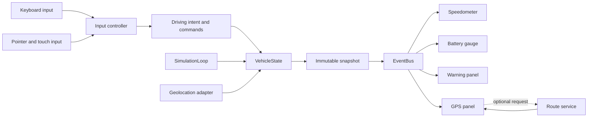

# Interactive Automotive Dashboard - Technical Specification

**Status:** Proposed baseline  
**Version:** 1.0  
**Methodology stage:** SPEC  
**Related specification:** [Functional specification](./functional-specification.md)

## 1. Architecture Summary

The application is a static single-page web application built with semantic HTML, modular CSS, and native JavaScript ES modules. A deterministic vehicle model owns all mutable simulation state. Input adapters translate keyboard and pointer activity into commands, a bounded animation loop advances the model, and passive UI components render immutable snapshots distributed through a small event bus.

External mapping, tile, route, icon, and font resources are presentation enhancements. The speedometer, battery, warnings, controls, coordinates, heading, and simulation remain functional without them.



## 2. Architecture Goals

- Keep one source of truth for vehicle state and business rules.
- Make simulation behavior deterministic and testable without a DOM or network.
- Keep visual components passive and independently replaceable.
- Define commands, thresholds, warnings, and events centrally.
- Prevent optional services from becoming runtime prerequisites.
- Support small Copilot-generated changes that can be validated in isolation.
- Avoid framework-like abstractions for a hackathon-sized application.

## 3. Recommended Folder Structure

```text
/
|-- index.html
|-- package.json
|-- README.md
|-- assets/
|   |-- images/
|   `-- fonts/
|-- docs/
|   `-- project-setup.md
|-- src/
|   |-- css/
|   |   |-- main.css
|   |   |-- base/
|   |   |   |-- reset.css
|   |   |   |-- typography.css
|   |   |   `-- variables.css
|   |   |-- layout/
|   |   |   `-- dashboard.css
|   |   `-- components/
|   |       |-- battery-gauge.css
|   |       |-- controls-legend.css
|   |       |-- energy-monitor.css
|   |       |-- gps-panel.css
|   |       |-- speedometer.css
|   |       `-- warning-panel.css
|   `-- js/
|       |-- main.js
|       |-- components/
|       |   |-- battery-gauge.js
|       |   |-- controls-legend.js
|       |   |-- energy-monitor.js
|       |   |-- gps-panel.js
|       |   |-- speedometer.js
|       |   `-- warning-panel.js
|       |-- config/
|       |   |-- constants.js
|       |   |-- keymap.js
|       |   `-- view-modes.js
|       |-- core/
|       |   |-- event-bus.js
|       |   |-- simulation-loop.js
|       |   `-- vehicle-state.js
|       |-- input/
|       |   `-- keyboard-controller.js
|       |-- services/
|       |   |-- geolocation-service.js
|       |   `-- route-service.js
|       |-- ui/
|       |   |-- cockpit-view-controller.js
|       |   `-- theme-controller.js
|       `-- utils/
|           |-- dom.js
|           `-- math.js
|-- test/
|   |-- cockpit-view-controller.test.js
|   |-- event-bus.test.js
|   |-- keyboard-controller.test.js
|   |-- navigation.test.js
|   |-- simulation-loop.test.js
|   `-- vehicle-state.test.js
`-- .github/
    |-- AGENTS.md
    |-- agents/
    |   |-- architect.agent.md
    |   |-- documentation.agent.md
    |   |-- frontend-developer.agent.md
    |   |-- qa.agent.md
    |   `-- ux.agent.md
    |-- instructions/
    |   |-- frontend.instructions.md
    |   |-- testing.instructions.md
    |   `-- ui.instructions.md
    |-- skills/
    |   |-- acceptance-test-generator/SKILL.md
    |   |-- dashboard-component-generator/SKILL.md
    |   |-- documentation-generator/SKILL.md
    |   `-- keyboard-command-validator/SKILL.md
    `-- spec/
        |-- backlog.md
        |-- functional-specification.md
        |-- implementation-plan.md
        `-- technical-specification.md
```

Empty `assets/images/` and `assets/fonts/` directories do not need to be committed. Add them only with assets required by the selected visual design.

## 4. File Responsibilities

### 4.1 Root And Documentation

| Path | Responsibility |
| --- | --- |
| `index.html` | Semantic application shell, landmark structure, fallback content, stylesheet links, and module entry point. It contains no simulation logic. |
| `package.json` | Project metadata and deterministic `start` and `test` commands; no production build is required. |
| `README.md` | Short operator guide: purpose, prerequisites, startup, controls, service fallbacks, and test command. |
| `docs/project-setup.md` | Presentation-ready consolidation of product spec, architecture, roadmap, backlog, Copilot setup, decisions, assumptions, and risks. |
| `assets/images/` | Optimized raster assets that directly support the cockpit experience. Avoid decorative stock imagery. |
| `assets/fonts/` | Optional self-hosted fonts and license information when external font delivery is undesirable. |

### 4.2 CSS

| Path | Responsibility |
| --- | --- |
| `src/css/main.css` | Defines cascade layer/import order only; component rules remain in their owning files. |
| `src/css/base/variables.css` | Design tokens for color, spacing, type, elevation, motion, and instrument dimensions; includes theme overrides. |
| `src/css/base/reset.css` | Minimal normalization, box sizing, reduced-motion defaults, and inherited control typography. |
| `src/css/base/typography.css` | Font faces, numeric typography, labels, and unit styles. |
| `src/css/layout/dashboard.css` | Cockpit shell, page regions, responsive grids, viewport constraints, and focus-safe overflow behavior. |
| `src/css/components/speedometer.css` | Gauge geometry, stable numeric display, scale, needle/ring states, and speed-specific responsive behavior. |
| `src/css/components/battery-gauge.css` | Charge visualization and normal, low, critical, and charging states. |
| `src/css/components/warning-panel.css` | Alert hierarchy, severity treatments, live-message placement, and empty state. |
| `src/css/components/gps-panel.css` | Map/fallback surface, route summary, coordinates, heading, and map control placement. |
| `src/css/components/energy-monitor.css` | Range, consumption, odometer, and secondary energy metrics. |
| `src/css/components/controls-legend.css` | Keyboard legend and pointer/touch control surface with stable hit targets. |

### 4.3 JavaScript Configuration And Core

| Path | Responsibility |
| --- | --- |
| `src/js/main.js` | Composition root: locate required DOM, instantiate dependencies, subscribe components, render the initial snapshot, start the loop, and clean up on unload. |
| `src/js/config/constants.js` | Frozen simulation limits, rates, thresholds, event names, warning catalog, and navigation defaults. No module duplicates these values. |
| `src/js/config/keymap.js` | Frozen action catalog and `KeyboardEvent.code` bindings used by input handling and the visible legend. |
| `src/js/config/view-modes.js` | Stable view identifiers and labels for the cockpit view controller. |
| `src/js/core/event-bus.js` | Minimal synchronous publish/subscribe API with unsubscribe support and predictable listener iteration. |
| `src/js/core/simulation-loop.js` | `requestAnimationFrame` lifecycle, bounded elapsed-time calculation, and one update callback per frame. |
| `src/js/core/vehicle-state.js` | Sole mutable vehicle model; validates transitions, advances physics, derives warnings and display metrics, and emits immutable snapshots. |

### 4.4 JavaScript Input, Components, Services, And UI

| Path | Responsibility |
| --- | --- |
| `src/js/input/keyboard-controller.js` | Convert keyboard and pointer control events into held intents or press commands; prevent key-repeat toggles and clear stuck inputs. |
| `src/js/components/speedometer.js` | Render speed-related fields from a snapshot with no model mutation. |
| `src/js/components/battery-gauge.js` | Render charge, range, and battery status from a snapshot. |
| `src/js/components/warning-panel.js` | Resolve warning IDs through the catalog, sort by severity, render active alerts, and announce priority changes. |
| `src/js/components/gps-panel.js` | Render map or coordinate fallback, position, heading, route status, and destination interactions. |
| `src/js/components/energy-monitor.js` | Render range, consumption, and odometer values. |
| `src/js/components/controls-legend.js` | Generate visible command labels and bind on-screen controls from the central key map. |
| `src/js/services/geolocation-service.js` | Promise-based adapter around browser geolocation with validation and normalized domain errors. |
| `src/js/services/route-service.js` | Abortable route lookup, response validation, stale-request protection, and deterministic fallback. |
| `src/js/ui/cockpit-view-controller.js` | Manage exclusive cockpit views and their `hidden`, `aria-hidden`, and visible-label state without affecting simulation. |
| `src/js/ui/theme-controller.js` | Apply theme tokens, persist a valid preference, respect platform preference, and maintain accessible control labels. |
| `src/js/utils/dom.js` | Small fail-fast DOM query and safe text/attribute update helpers. |
| `src/js/utils/math.js` | Pure clamp, interpolation, angle, and geographic calculations. |

### 4.5 Tests And Copilot Assets

| Path | Responsibility |
| --- | --- |
| `test/*.test.js` | Native Node unit and integration tests, organized by owning runtime module. Browser-only behavior is isolated behind fakes. |
| `.github/AGENTS.md` | Project-wide operating rules for human and AI contributors. |
| `.github/instructions/*.instructions.md` | Automatically scoped implementation, UI, and test rules selected by file glob and description. |
| `.github/agents/*.agent.md` | Focused role agents with minimal tool permissions and explicit outputs. |
| `.github/skills/*/SKILL.md` | Repeatable, on-demand workflows for components, commands, documentation, and acceptance tests. |
| `.github/spec/*.md` | Canonical product, technical, planning, and backlog artifacts for `SPEC -> PLAN -> IMPLEMENT`. |

## 5. Application Modules

### 5.1 Configuration

Configuration exports deeply immutable values. Physical constants, battery thresholds, route defaults, event names, warning definitions, actions, and key bindings are never hard-coded in components or controllers.

### 5.2 Vehicle Domain

`VehicleState` is the only mutable domain owner. It accepts explicit commands and an elapsed-time update with a driving-intent object. It enforces invariants before publishing a new snapshot.

Expected public surface:

```js
vehicleState.update(deltaSeconds, drivingIntent);
vehicleState.toggleEngine();
vehicleState.toggleCharging();
vehicleState.setPosition({ lat, lon });
vehicleState.snapshot;
```

The implementation may add narrowly scoped commands, but components must never receive write access to state.

### 5.3 Input

The input controller distinguishes:

- `HOLD`: active from key/pointer down through key/pointer up.
- `PRESS`: triggered once on the transition to down and never from repeated `keydown` events.

The same binding data generates visible controls, documentation tables, and tests. Browser-default suppression is limited to recognized controls while the experience is active.

### 5.4 Presentation Components

Each component owns one root element and exposes a small lifecycle such as:

```js
component.render(snapshot);
component.destroy?.();
```

Components format values, set classes and ARIA state, and manage local presentation integrations. They do not calculate vehicle physics, thresholds, or command rules.

### 5.5 Browser And Network Services

Service modules normalize platform APIs and remote responses into application-level results. They use timeouts or abort signals where possible. Raw third-party payloads and errors do not leak into components.

## 6. State Management Strategy

### 6.1 State Shape

The immutable `VehicleSnapshot` contract contains only serializable values:

| Field | Type | Rule |
| --- | --- | --- |
| `speedKmh` | number | Finite and clamped to the speed range. |
| `batteryPercent` | number | Finite and clamped to `0-100`. |
| `headingDeg` | number | Normalized to `[0, 360)`. |
| `position` | `{ lat, lon }` | Finite valid geographic coordinates. |
| `odometerKm` | number | Non-negative and monotonically increasing. |
| `rangeKm` | number | Derived from battery state. |
| `consumptionKwh100` | number | Non-negative derived display value. |
| `engineOn` | boolean | False when battery is empty or charging. |
| `charging` | boolean | True only while stopped with ignition off. |
| `warnings` | string[] | Ordered warning IDs from the shared catalog. |

### 6.2 Update Rules

1. Collect current driving intent.
2. Bound elapsed time to prevent a large tab-resume jump.
3. Apply braking, acceleration, or drag in deterministic precedence order.
4. Clamp speed.
5. Apply charging or elapsed-time battery drain.
6. Enforce empty-battery and charging invariants.
7. Update heading, distance, position, odometer, and derived metrics.
8. Recompute the warning set and publish warning lifecycle events.
9. Publish one immutable state snapshot.

No component keeps a competing copy of domain state. UI-only preferences such as theme and current view remain in their dedicated controllers.

## 7. Event Management Strategy

Use a small in-process `EventBus`, not DOM custom events, as the boundary between domain and rendering.

| Event | Payload | Producer | Consumers |
| --- | --- | --- | --- |
| `state:changed` | `VehicleSnapshot` | `VehicleState` | All instruments and UI summaries |
| `warning:raised` | Warning ID | `VehicleState` | Warning panel, optional audio adapter |
| `warning:cleared` | Warning ID | `VehicleState` | Warning panel |
| `input:key-state-changed` | Action and active state | Input controller | Control legend and diagnostics |
| `cockpit:view-changed` | View ID | View controller | View label and optional lazy integrations |

Rules:

- Event names are constants.
- `on()` returns an unsubscribe function.
- Listener mutation during publish must not skip or duplicate other listeners.
- Domain events are synchronous and local; network operations remain promise-based services.
- Subscribers clean up during component destruction.
- Events communicate completed facts, not imperative DOM instructions.

## 8. Rendering Strategy

- Render the initial snapshot before starting animation.
- Advance simulation with `requestAnimationFrame` and a bounded elapsed-time delta.
- Publish at most one state snapshot per simulation step.
- Let each component update only its owned DOM subtree.
- Prefer `textContent`, attributes, classes, and CSS custom properties over HTML string replacement.
- Cache required element references during construction.
- Round values only for presentation; preserve domain precision in state.
- Keep map updates less frequent than speed display updates if profiling shows a cost.
- Respect `prefers-reduced-motion`; motion communicates change but is never the only signal.

Direct DOM rendering is appropriate because the application has one screen, a small state graph, and limited component depth. Introducing a virtual DOM or state library would add dependencies without reducing meaningful complexity.

## 9. External Libraries And Services

| Dependency | Purpose | Justification | Fallback |
| --- | --- | --- | --- |
| Leaflet 1.9.x | Interactive map rendering | Proven accessible map controls and lower risk than writing a map engine. | Coordinate and heading panel. |
| OpenStreetMap-compatible tiles | Map imagery | Familiar geographic context with no proprietary SDK. | Styled offline surface. |
| Public OSRM endpoint | Demonstration route and next maneuver | Avoids implementing routing logic and requires no backend. | Straight-line distance or route unavailable status. |
| Lucide | Familiar interface icons | Consistent icon set with accessible labels supplied by the app. | Text labels or bundled critical icons. |

Rules for external resources:

- Pin explicit versions and document licenses/attribution.
- Do not block application startup on a CDN response.
- Never send browser location to a route service until the user requests route functionality.
- Keep all third-party calls inside service or component adapter boundaries.
- Avoid adding a package when a small standard-platform implementation is clearer.

## 10. Error And Degradation Architecture

- Domain methods reject invalid transitions by returning a result and preserving state.
- Services return normalized outcomes such as `success`, `denied`, `unavailable`, `timeout`, or `invalid-response`.
- Components render a local fallback and keep the last valid domain snapshot.
- Development diagnostics may use `console.error` with context; user messages never expose stack traces.
- The composition root catches initialization failures per optional integration so one failure does not cascade.
- A missing required DOM node is a development error and fails fast with a precise selector name.

## 11. Accessibility Architecture

- Use semantic landmarks and headings in `index.html`.
- Use native `button` elements for commands.
- Give every icon-only control an accessible name and tooltip.
- Maintain visible `:focus-visible` treatment with at least `3:1` contrast.
- Use `aria-pressed` for toggles and `aria-live="polite"` for priority alert changes.
- Keep decorative gauge marks hidden from accessibility APIs.
- Expose a concise textual speed, battery, GPS, and warning equivalent.
- Ensure controls are at least `44x44 CSS px` on touch layouts.
- Preserve the full workflow at `200%` browser zoom and with reduced motion.

## 12. Performance Requirements

- Keep the JavaScript dependency footprint small and load scripts as ES modules.
- Avoid layout reads after writes within a frame.
- Update high-frequency values without recreating component subtrees.
- Bound simulation delta to `100 ms` after pauses or background tabs.
- Abort superseded route requests.
- Lazy-initialize the map only when its container and library are available.
- Target first usable local render within `2 seconds` and input feedback within `100 ms`.

## 13. Testing Strategy

Use the native Node test runner for deterministic modules and a real browser for integration and visual checks.

| Layer | Scope | Examples |
| --- | --- | --- |
| Unit | Pure math, event bus, state transitions, warning thresholds, route parsing | Boundary and parameterized tests |
| Component contract | Snapshot-to-DOM behavior with minimal fakes | Value formatting, classes, ARIA state |
| Integration | Input controller through vehicle state and events | Hold/release, repeat suppression, blur cleanup |
| Browser acceptance | Full user scenarios and degradation | Keyboard/touch flow, denied location, offline map |
| Visual/accessibility | Target viewports, themes, zoom, reduced motion | Screenshots, overlap checks, automated and manual audit |

Tests use fake clocks, deterministic positions, injected adapters, and representative deltas. They do not call public geolocation, tile, or route services.

## 14. Coding Conventions

### 14.1 JavaScript

- Use native ES modules and named exports, except where one default export is already established.
- Use `const` by default and `let` only for reassignment; never use `var`.
- Use private class fields only for meaningful encapsulation; prefer functions for stateless behavior.
- Add JSDoc for public contracts and non-obvious object shapes.
- Name booleans with `is`, `has`, `can`, or an unambiguous state adjective.
- Use descriptive identifiers; avoid one-letter names outside conventional coordinates.
- Keep functions focused, side effects at boundaries, and numeric constants in configuration.
- Handle promises explicitly and distinguish expected service failures from programming errors.
- Use double quotes and trailing commas to match the repository style.

### 14.2 HTML

- Use one `h1`, logical heading order, landmarks, native controls, explicit labels, and valid ARIA.
- Keep content and fallback text meaningful before JavaScript starts.
- Use `data-*` attributes for component hooks and state; do not couple JavaScript to cosmetic classes.
- Do not place inline event handlers, scripts, or styles in markup.

### 14.3 CSS

- Use mobile-first responsive rules and component-owned files.
- Use design tokens for all repeated colors, dimensions, spacing, radii, and motion.
- Use BEM-like component names or the existing component naming convention consistently.
- Avoid IDs for styling, `!important`, negative letter spacing, viewport-scaled type, and layout-changing hover effects.
- Keep cards at `8px` radius or less and avoid cards nested inside cards.
- Validate color contrast in every theme and severity state.

### 14.4 Tests And Documentation

- Name tests by observable behavior: `rejects charging while ignition is on`.
- Follow Arrange, Act, Assert without explanatory comments unless setup is unusual.
- Test public behavior rather than private implementation.
- Update requirement and ticket references when behavior changes.
- Keep README operational and keep design rationale in the spec or decision records.

## 15. Architecture Decisions

### ADR-001 - Native Web Platform

**Decision:** Use HTML, CSS, and JavaScript ES modules with no application framework or build step.  
**Rationale:** The product has one bounded screen and a small state graph. Native modules reduce setup, dependency, and debugging cost while satisfying the constraint.  
**Trade-off:** Manual DOM lifecycle and module conventions require discipline.

### ADR-002 - Single Mutable Vehicle Model

**Decision:** Allow mutable domain state only inside `VehicleState`; publish immutable snapshots.  
**Rationale:** This prevents instruments from diverging and makes transitions independently testable.  
**Trade-off:** Every state change must pass through the model, including geolocation updates.

### ADR-003 - Local Event Bus

**Decision:** Use a minimal synchronous event bus for domain-to-view notifications.  
**Rationale:** It decouples instruments without introducing a state library and gives explicit unsubscribe behavior.  
**Trade-off:** Event names and ownership must remain tightly controlled to avoid hidden flow.

### ADR-004 - Time-Based Simulation

**Decision:** Calculate motion and energy from bounded elapsed time supplied by `requestAnimationFrame`.  
**Rationale:** Behavior remains consistent across machines and can be tested with known deltas.  
**Trade-off:** Background-tab recovery must clamp large elapsed intervals.

### ADR-005 - Progressive GPS Enhancement

**Decision:** Treat coordinates and heading as core; map tiles, geolocation, and routing are optional adapters.  
**Rationale:** The hackathon demo remains functional offline and when permissions are denied.  
**Trade-off:** The GPS component must maintain both enhanced and degraded render paths.

### ADR-006 - Central Command Catalog

**Decision:** Derive keyboard handling, on-screen controls, help text, and command tests from one binding catalog.  
**Rationale:** This eliminates drift between controls and their documentation.  
**Trade-off:** Binding schema changes affect several consumers and require contract tests.

### ADR-007 - Native Node Tests Plus Browser Acceptance

**Decision:** Use `node --test` for deterministic logic and browser checks for DOM, accessibility, and layout.  
**Rationale:** The unit suite stays dependency-light while browser-only risks are still validated at the correct boundary.  
**Trade-off:** Full browser automation can be deferred until the MVP behavior stabilizes, but manual acceptance evidence is required meanwhile.

## 16. Security And Privacy Considerations

- Do not store location, route, or driving history beyond the current page session.
- Validate coordinates and remote response shapes before use.
- Insert untrusted text with `textContent`, never `innerHTML`.
- Use HTTPS endpoints for remote services and document data disclosure.
- Pin external library versions and prefer integrity metadata when loaded from a CDN.
- Do not introduce secrets, API keys, or environment-specific credentials into this static project.

## 17. Local Development And Validation

Prerequisites: a current Node.js release and either Python 3 or another static HTTP server.

```powershell
npm test
npm start
```

The default local URL is `http://localhost:5500`. ES modules must be served over HTTP rather than opened directly from disk.

## 18. Requirement Coverage

- REQ-001 through REQ-025 are owned by the composition, input, domain, component, and service modules above.
- REQ-026 through REQ-035 are enforced by rendering constraints, accessibility rules, service boundaries, tests, and local validation gates.
- The implementation plan and backlog provide the exact requirement-to-work-item mapping.